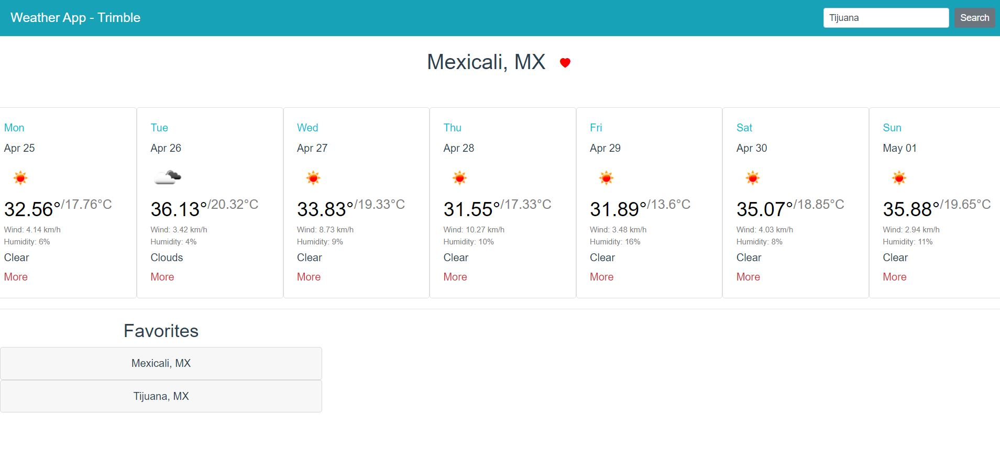

# Weather App

This is a weather app that allows the user to look for the weather of a specific area by city name or zipcode.
It shows the daily forecast and an hourly forecast for each day.

 ## Tech Stack

**Client:** Vue 2.6.14

## Run Locally

Clone the project

```bash
  git clone https://github.com/JCGarcia96/WeatherApp.git
```

Go to the project directory

```bash
  cd WeatherApp
```

Install dependencies

```bash
  npm install
```

Start the server

```bash
  npm run serve
```


## Features

- Search by city or zipcode
- Forecast by day and by hour
- Save favorite places


## Screenshots



## Links

[Weather App Backend](https://github.com/JCGarcia96/WeatherAppBE)

## License

[MIT](https://choosealicense.com/licenses/mit/)


## Acknowledgements

 - [Open Weather Map](https://openweathermap.org/)


